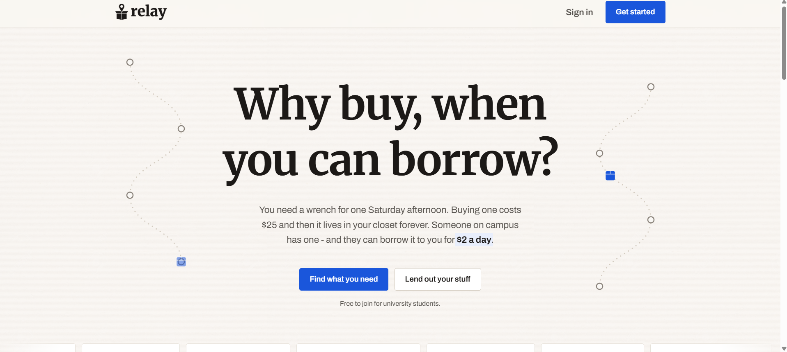
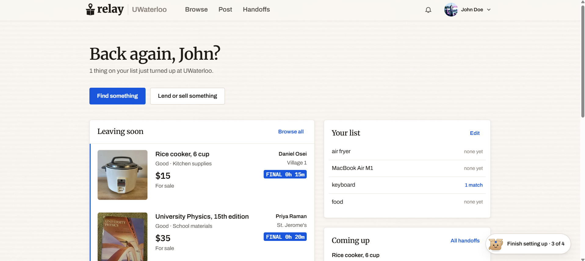
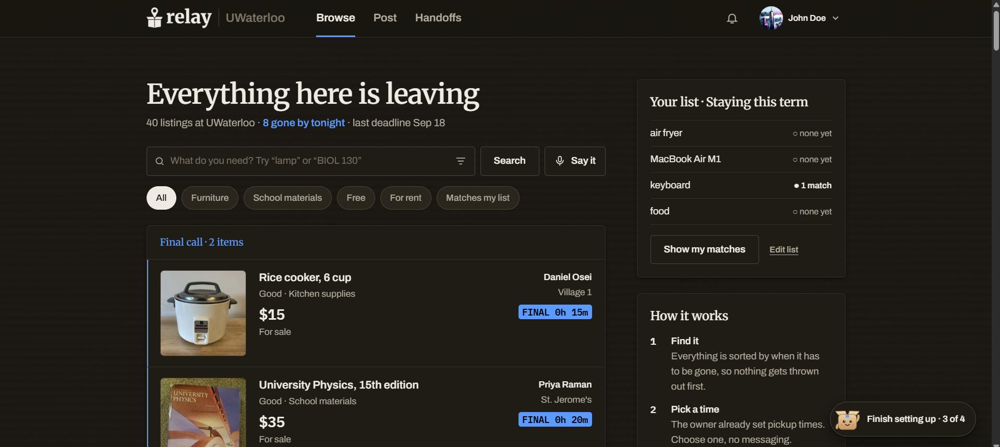
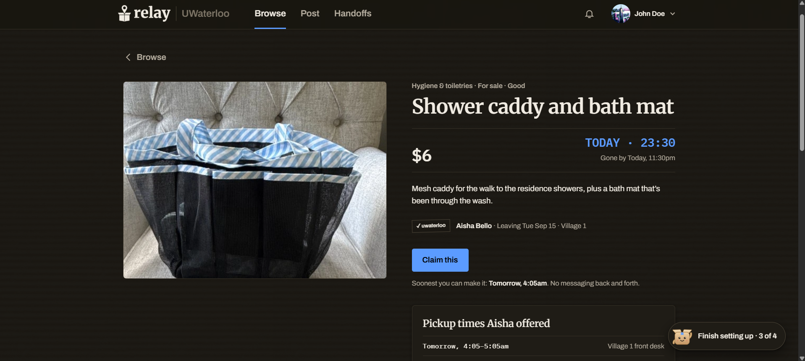
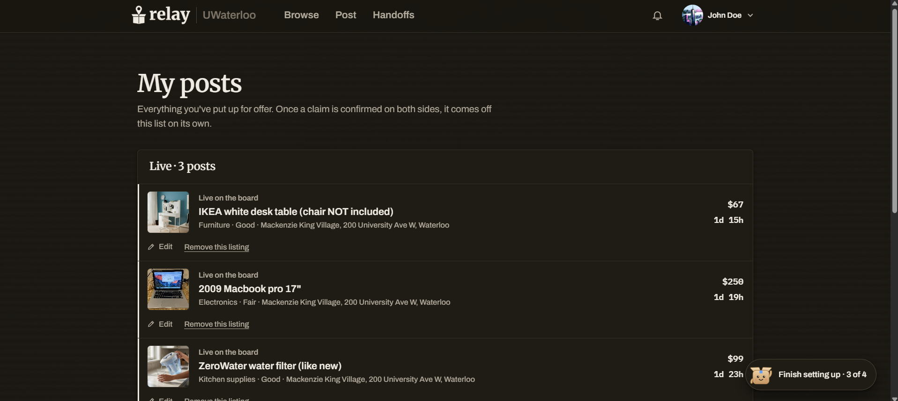

<p align="center">
  
</p>
<h3 align="center">Why buy, when you can borrow?</h3>

You need a wrench for one Saturday afternoon. Buying one costs $25 and then it lives in your closet forever. Someone on campus has one - and they can borrow it to you for **$2 a day**.
<p align="center">
<i>Built at <b>PivotHacks26</b>.</i>
</p>

## Pics

<p align="center">
  
</p>

<p align="center">
  
  
</p>

<p align="center">
  
  
</p>


## Setup

```bash
npm run dev
```

http://localhost:4287

|cmd|Purpose|
|---|---|
| `npm run seed` | regenerate `data/seed.json`: deterministic |
| `npm run pipeline` | embed + rerank → `data/dataset.json`, `data/matches.json` |
| `npm run chains` | print computed chains to the terminal |
| `npm run typecheck` | `tsc --noEmit` |

Requires Node 22, project passes `--experimental-strip-types` for Node < 22.18.

## Stack

|Tech|Description|
|---|---|
| **Next.js 16** · React 19 · TypeScript | Rendered on server, obviously |
| **Tailwind v4** | Theming |
| **Supabase** | Postgres and auth, low level security on each table |
| **Snowflake Cortex** | `AI_EMBED` for semantic search, `AI_COMPLETE` for reranking. Retrieval runs where the data already lives instead of shipping it to an LLM API |
| **Backboard.io** | Memory and RAG. Every want stored as memory as recomendation for new listings |
| **Resend** | Sends university-email verification codes |

## Team

*in no particular order...*

Jayden Chen

Andrew Li

Adarsh Thoduvakkal

Brian Xue
